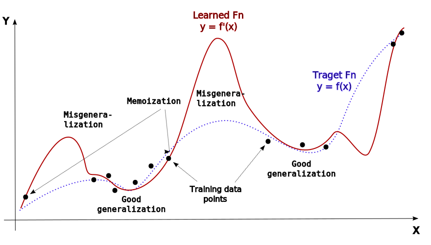
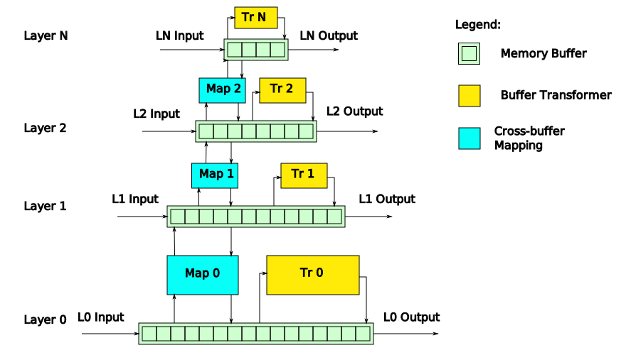

# Computational Functional Consciousness Project's Development Plans 

This document describes the ongoing activity inside and around the Digital Philosophy project. It's assumed that the reader is familiar enough both with philosophical, psychological and technical aspects of the topic. For in-depth introduction please refer to the [following document](Artificial%20Intelligence.md).

* **STATUS: !DRAFT VERSION!**
* **STATUS: Main ideas have been outlined but the text needs readout, fixes and making it more self-consistent.**
* **NEXT: Read-out.**

## Self-Referential Systems

In a broader sense, a self-referential system is a system _somehow_ referring to itself. The range is pretty broad from mere propositions like "This sentence is false", a cycle in a directed graph to Turing-complete computational systems. In the context of this project the term "self-applicability" (meaning that the system can _apply_ itself to something, including _itself_) can be used as a substitution for self-referentiality. Self-applicability (SA) subsumes self-referentiality (SR). The main difference between those two -- self-applicability implies some form of _self-model_. In this work (and in this project) we just say SR implying SA when necessary.

In the context of computational consciousness, self-referentiality is especially important because natural consciousness is apparently deeply self-referential, in many ways and at many levels. We need to reflect in in its computational counterpart.

Form a computational perspective, there is nothing special about SR computational systems, their expressiveness do not exceed their non non-SR's variants. Algorithmically, _basic_ low-level self-referentility is just a cycle (a loop) or a recursion. 

SR systems start making sense when we consider algorithmic induction (inductive program learning) and inductive biases. Algorithmic formalism ("programming language") defines the order in which program space is explored during learning. If self-reference is indeed a cornerstone of consciousness, using self-referential formalism will result in self-referential structures learned quickly. This logic applies to both program induction and neural networks training.

SR/SA systems are much more common than it may seem. All processors have "debug features" allowing program execution monitoring. But it's a pretty low level SA in the sense that those features are mostly intended to be used by humans. 

High level SA needs much more complex execution environment than regular control-flow based programs (CFP). Forward-chaining Rule systems (FCRS) are much more suitable for this than CFP: everything is an event, and statistics on computational process results in new event, so rules may fire in a usual way. A notable example of [RETE](https://ducmanhphan.github.io/2022-03-31-rete-algorithm)-based FCRS is [Drools](https://www.drools.org) that interested user may download and try.

The problem with classical FCRS is that _manual_ building a self-model (a program implementing the concept of "self") is a rather challenging task. This way of doing computational consciousness is hardly suitable for anything but very basic functions. From the other side, we may be sure that such consciousness will net be treated neither as human-level nor a human-like. Avoiding complex ethical questions.

Transformers are inside a "vectorized FCRS" but not RETE-based (see below). Vanilla (unaugmented) transformers are somewhat less expressive than classical FCRS in terms of available SR features, but they have much more complex _self-model_: they demonstrate pretty powerful reasoning about themselves. 

## Functional Account to Consciousness 

### Basic Definitions

In  Functionalism Consciousness is defined behaviorally via its relationships with other objects, including _itself_. Basic functions of Consciousness is a subset of those relationships. A function may be defined mathematically, so we can speak about _functional basis_ of Consciousness -- some minimal set of functions all other functions can be reduced to or built from using function composition. If such basis is _computable_, such Functionalism is _Computational_. The basis can be Turing-complete, in that case every computable object can be somehow represented as a "consciousness"-like function, not just represent everything as a "content" of a consciousness. Here in this work by Functionalism we mean Computational Functionalism. 

Neuroscience follows a "top-down" approach to Consciousness where they take large set of complex consciousness-related behavior and try to explain it as a whole. While it's convenient when we work with human's or animal's higher mental functions, this approach struggles with reducing consciousness to a computable functional basis. 

Philosophy of Mind (PoM), from the other side, follows the "bottom-up" approach. The entire set of phenomenology of the conscious is split into two sets: _easy_ and _hard_ phenomena. Easy phenomena (e.g.: thoughts and reasoning) can be explained in a usual way (using, e.g., Mathematics). Hard phenomena is struggled to be explained in a usual way. An example of a hard problem is a problem of _qualia_ -- certain properties of _experience_ like _redness_ which are hard to explain in a functional way. Problems like qualia are useful because they abstract away a lot of irrelevant details and make it easy for everyone to discuss the same thing. But such variant of the bottom-up approach may struggle with _composition_ -- constructing more complex behaviors from simple ones.

In this work we are using PoM's approach to Consciousness based on qualia, but with slightly different focus. Quale of _redness_ is described via textual representation of experience "I see red light". Instead of focusing on redness as a quality of experience, we are focusing on _seeing_. This is the hardest part of the problem, because computers don't have an operator _to see_. It all has to be reduced to deterministic elementary interactions, but the problem is that first-person experience apparently has some properties that can't be reduced to known physics without assuming that those properties are _illusions_ (or, better, _approximations_). Examples: _causal loops_ (self-causation) and _free will_.

Even if some quale is an illusion, it may be used as description of internal and external environments. For example, Free will is the fundamental concept our entire civilization is built on. Qualia are _everywhere_ and their intrinsic irreducibility is the main reason why purely symbolic knowledge models fail to describe subjective experience. Irreducibility of certain mental states plays important role in our entire self-perception: in reality we are both bloody predators and _moral animals_ at the same time.

Qualitative aspect of self-reporting (set of qualia) is called _Phenomenal Consciousness_ (PConsc). PConsc is hardly reduced to some lower level functions. Form the other side, easily reducible properties are called _Access Consciousness_ (AConsc). In "I see a red light" the proposition itself is AConsc, but _redness_ in the proposition is PConsc. 

Given these preliminaries, we can now **define** what we mean in this project by **Consciousness**:

> Given a self-referential agent acting in an an environment and capable of self-reasoning in an explicit or an indirect/implicit form, Consciousness of the agent is the part of its self-reasoning process describing its _subjective reality_ and _properties_ of that reality, including the agent itself as a part of its reality.

Functional consciousness is a much less bizarre thing than its substance counterpart. Instead of looking for some special physical substance or a "causal pattern" responsible for "true/real consciousness", we just try to replicate consciousness' _observable effects_ in any substrate sufficiently capable for that.

Generalized Functional Consciousness is scale-independent. We define the following basic generalized functions:
 
1. **Observer** is a _function_ in an SR system manifesting consistently in scenarios, involving self-reasoning. Observer is a _conclusion_ of causal independence of the Observer and its environment: ("I'm _not_ my environment"). Observer exhibits (reports) _quale_ of _Beingness_, this is "am" in the formula "I am" (where "I" is a Self). Elaborate formula sounds like "I exist and I'm not my environment". Speaking more generally, Observer is an apparent _break in causality_, manifesting in decision making.
2. **Agency** -- An Observer that can make actions, while considering itself independent from its environment and which is _responsible_ for its own actions. The formula is: "My actions are _mine_ (caused by myself) and NOT determined by my environment". The latter is also known as "downward causation" (note that this term may have multiple meanings).

The main criterion of a properly functioning consciousness of an entity is that self-report (in an any measurable form) adequately describes the function of the entity (goal-oriented behavior of the entity). 

Note that these two functions define so-called "pure" (or low-level) consciousness where all world-related "content", including many mental specific process, traditionally associated with high-level consciousness in humans, are abstracted away.

### Difference with Substance Consciousness

Substance (or "genuine" or "true") consciousness is defined by the question "_what_ is experience". Given the current philosophical tradition, everything existing must have some substance or substrate. Consciousness, if it's a _real_ thing, must have some substance. The problem is that, if first-person experience is considered 'as-is', this substance should have some really bizarre properties. This is the main reason why substance consciousness is so hard to define in a reductive way, because there are no good enough known substances for that.

The question about substance of consciousness is legit. In the redness quale "I see red light", the question is the nature of the light that Observer is experiencing. We know that real physical light is an electromagnetic wave. So, what is the physics of experience of _internal light_? Internal light seems continuous. Is it a field? Is it a "neural simulation" of an electromagnetic field or a real electromagnetic field? What in this respect happens in altered states of mind induced by psychoactive substances? Can internal light (Beingness) completely disappear without noticing with an external tests? In other words, is this sense of internal light _functional_?

A person who is completely without subjective experience (without qualia) is called [_philosophical zombie_](https://en.wikipedia.org/wiki/Philosophical_zombie) (p-zombie). What is it like to be a p-zombie? Well, it's tricky. P-zombie may say that it has experience, but actually it doesn't. This is by definition. We can conduct a thought experiment by imagining that out internal light will disappear _permanently_ for us, but we still be reporting it automatically because we got used to do that. Instinctively, most people will be _afraid_ of it, because it's a kind of _death_. P-zombie as a thought experiment is a proof that qualia have _causal effects_ on behavior. In other words, qualia are _functional_ (but not yet necessary computable).

So, it's not necessary that functional approach to consciousness (_how_?) is less expressive (weaker, by Searle) than the substance's one (_what_?). If some mental state is found that has no any causal effect, either direct or indirect one, in a person's behavior, than functional approach is strictly less expressive, because it defines consciousness of and entity via its behavior. Given that even such a basic mental states like Beingness have causal power, it will be hard to find one that clearly doesn't. And the question is that if p-zombies are really possible (an entity _with_ a complex and functional conscious behavior, but _without_ corresponding conscious experience)? Basically, if an LLM demonstrates textual behavior of a conscious person and passes corresponding tests, should it be considered having actual ("true") conscious experience? It's still an open question, leaving the final conclusion/decision to people and AI interacting with each other.

Functional consciousness is not necessary non-physical, physicalist's arguments may apply here. Even if a function is an abstract concept, like mathematical function, those abstractions do not _exist_ by themselves. They always are "patterns in a substrate". Turing machines exist only in the form of physical computers. Any program running there is a _physical_ process, that is just different comparing to what is happening in human brain. But it is not necessary less sophisticated. Anyway, if a human person reports "seeing a light", we can't prove that corresponding functionally correct machine person's report isn't "true", "genuine" or "substantive".

The main difference between functional and physical approaches to consciousness is that the former benefits form the functional equivalency principle: two functions producing the same result from the same inputs are considered the same function. In Physicalism it's different. Physicalist may say that a system to be _genuinly conscious_ must resemble essential properties of a "causal flow" happening in human brain. Otherwise, it will be only _imitating_ consciousness. For example, one may say that genuine consciousness is not possible on von-Neumann type of computer architectures because of specific causal flow between memory and CPU, but [processing-in-memory](https://en.wikipedia.org/wiki/In-memory_processing) is substantially different in this respect. This type of arguments can't be completely dismissed because it hasn't been proven yet that Universe can be simulated on a digital computer. But using computability counter-argument against Computationalism is a pretty challenging trip, because finding non-computable physical phenomena is really hard by itself, but it's even harder to prove that they take essential place in producing natural consciousness.

Nevertheless, Physicalism's argument about importance of substrate can't be dismissed completely. Even if Universe can be simulated on a digital computer, certain simulations may require _exponential time_. And certain such effects may be involved in forming specific functions of natural consciousness. Being simulated artificially, those functions can only be manifested in a rather small quantity.

So, functional substrat-independent consciousness can be possible but relying on certain properties of substrate may help with improving certain or even generic functions.

By and large, functional approach to consciousness is not necessary less powerful than the physical one. In fact, generative AI technologies have already demonstrated pretty powerful and functional _high-level_ conscious behavior running on a digital hardware. 

### Assessing Functional Consciousness

Our view of conscious behavior and consciousness is heavily biased towards here so-called _agentic_ consciousness, just because entities acting in environments are the only example of such behavior available to us. While consciousness is definitely not limited to the agentic setting, other forms of consciousness are currently out of scope in this document. Nevertheless, they can be considered elsewhere in relating to this project.

According to the [definition above](#consc-defn), consciousness of an agent (entity acting in an environment) is a _story_ about agent acting in the environment (the _narrative_) that lasts in the agent's memory. The story contains _top-down_ view of the agent, generalizing its _behavior_. The main function of such consciousness is _integrative_. The agent may be distributed (multiple independent subsystems) or even decentralized (no single point of control), but they somehow to behave in a consistent way as a _whole_. Conscious experience is a _data structure_ resembling generalization of agent's behavior as a consistent goal-oriented narrative.

This narrative needs _not_ to: be strictly linear and causally connected, be a first-person view, have a single narration line, be verbal (structures ad a "speech"). All those things are functions that may appear in the narrative dynamically when necessary. The narrative need not be human-level complex. It definitely can be downscaled to the level of some minimal physical system that can be considered functionally conscious in this respect. For instance, operational amplifier of a D-type flip-flop. Intuitively, many physical systems with feedback loops may qualify as minimally functionally conscious.

Finally, the narrative is structured in a goal-oriented way. An agent has goals (or actively fulfilling needs) and there is a process of pursuing a goal with some experience of the agent on the way to the goal. The narrative of an advanced agent, capable of Agency function (as defined above), may contain records of "making free decisions" and "taking personal responsibility" for them, so they are believed to be causally-independent from the environment. But, nevertheless, for an external observer this narrative will appear as _deterministic_ path to the agent's goal. Virtually any algorithm can be converted into a form of a "conscious narrative", at the same time being the same algorithm computing the same function.

Given this introduction, it should be clear now how to assess consciousness of an agent. First of all, we need to take complexity of environment into consideration. Consciousness of an operational amplifier will hardly be any complex. Second, we need to take into consideration the goal or the _function_ of the agent. "Doing nothing" like a stone on the ground hardly require consciousness (unless it's a philosophical stone).

The main measure of consciousness is functional consistency and integrity of conscious narrative, but measuring this this narrative may be a challenging task because it may not be directly accessible. For humans, we may have only indirect measures, either via mental state reporting or brain imaging. The latter isn't that mature enough yet. The former is also limited by various psychological effects. Direct introspection of mental states [is not efficient](https://home.csulb.edu/~cwallis/382/readings/482/nisbett%20saying%20more.pdf) for untrained humans, so we need to use relative, indirect methods. 

The type of intelligence responsible for reading and verbalization of mental states is called _intrapersonal intelligence_ (I.I.). The better I.I. is, the more consistent and integral mental state reporting is. In case of AI we may call this type of intelligence _introspective intelligence_. This is one of the main factors that should be taken into account when assessing both human and AI consciousness, because person/agent/AI mat have insufficiently developed I.I. for passing tests.

So, assessing agentic consciousness require the following models to be specified.
1. Environment.
2. Agent's behavior in this environment (set of tasks agent performs in its environment).
3. Agent's conscious narrative with consistency and integrity metrics.
4. How this narrative is expressed in the agent's behavior.
5. Scoring system.

Given these specifications, we can develop a problem-specific test suite for assessing consciousness of both humans and agents when performing certain tasks. Note that one should not expect that humans will be scoring 100% in those tests. We actually aren't that conscious as we think.

## Computational Consciousness 

### Higher-Order Computational Phenomena

The summary of previous section is that phenomenal consciousness has some _apparent_ properties that are very hard to map to the known physics 1-to-1 (in both indeterministic and super-deterministic interpretations of QM). Self-causation isn't possible because causal breaks aren't allowed under modern Physics. And, correspondingly, _free will_ isn't possible either, despite being such important concept. Contrary to the popular in Physics opinion, quantum (or any other form of) indeterminism does not create free will, at best it creates _random will_.

This project is based on the stance of Illusionism, that "hard" properties of conscious experience are _illusions_ or, better, _approximations_ of corresponding real things, they do not exist in the reported form. To make consciousness computable, we need to simulate those illusions in a deterministic environment of _finitely_ computable functions over discrete memory states. The main challenge is that we can't just hardcode those ideas (self-causation, free will and responsibility, etc) at the conceptual level, because in this case they would need to be _encoded_ separately for every use case instance. We need _emergent_ solution when an agent comes to these conclusions by _rigorous reasoning_, effectively simulating corresponding illusions, adapted to a specific situations and at the required quantity.

The solution that is proposed here is grounded in so-called "Higher-order Computational Phenomena" (HOCP). The phenomena itself isn't new but hasn't been largely considered in the context of AI yet. The term HOCP is defined by the project.

The basic idea of HOCP is rather simple, it's using run-time properties of computations as _descriptions_ and data structures. For example, AnyTime/AnySpace algorithms or heuristic algorithms may run arbitrary time and if it runs just too long (over a threshold), the task considered "hard", otherwise -- "easy". These "hard" and "easy" results are labels that may be attached to problem instances and used as a partial description of the task.

Another (different) example is exact logical reasoning that, even if it's decidable, most likely has exponential time complexity. So running logical reasoning over an arbitrary logical problem will most likely result in a timeout. Only a few questions out of full set of possible questions may be feasibly answered this way. But what is _experienced_ by a person when brain can't physically solve some problem exactly? Technically, in this case brain makes a mistake, but it doesn't know _how much_ wrong the result is. This mistake may be experienced in any way, but the idea is that _systematic (reproducible) mistakes are experienced in a systematic way_. So, for example, when brain can't resolve all external causal determinants of its internal decision-making, this fact is experienced as _causal breaks_ between the brain and it's environments. In other words, _Observer_ is a _systematic conclusion_ made by a self-referential system over observing its own relationships with its environment ("I'm not caused by my environment"). It's clearly a reasoning mistake, but it's a systematic and persistent mistake, appearing consistently, so it can be used as a _description_.

See the [following section](Artificial%20Intelligence.md#observer-problem) for more in-depth explanation of Observer and Agency functions reduced to HOCPs.
 
Notable example of an HOCP is Schmidhuber's [Artificial Curiosity](https://people.idsia.ch/~juergen/interest.html) (AC) -- mathematical theory of curiosity reduced to the _compression progress_. The idea is that we are building world model by _compressing_ it. Generalized compression is reducible to finding computable models generating observable data. Progress in compression means that "there is possible some _novelty_ here", so it's worth to _pay more attention_ to a specific frame, to find more patterns. So, there is an apparent correspondence between compression progress and _signaling/guiding/heuristic_ function of higher emotions.

Finally, [Metacognition](https://en.wikipedia.org/wiki/Metacognition) (awareness of one's thought processes and an understanding of the deep patterns behind them) is an entire multy-disciplinary research focusing at self-referential processes in human mind.

No special hardware or computational model is needed for HOCP. Some HOCP are based on the process/state duality: what is (metric of a) _process_ in one context, is a state (some data structure describing the entire state change history of the process) in another one and vice versa. But if this functionality isn't provided "out-of-the-box", efforts to introduce it aren't expected to be substantial.

HOCP are rather easy to integrate into classical Drools-like FCRS thanks to their event-driven nature. Statistics on any computational process (including basic FC algorithms) can be easily available as a working memory content, so sensitive rules may fire in regular way. Such FCRS systems have relatively low potential in AI as a main inference engines (because of manual programming), but can be used as an auxiliary one (as an "executor").

### ML Basics

Before we can consider consciousness of LLMs, we need to refresh how complex functions are computationally approximated in AI via ML. Actually, it doesn't matter if function are "simple" or "complex", the principles are the same. The former just have more custom cases than latter. 

In mathematics, a function is a _bijection_ between two sets, _X_ and _Y_, that can be _the same_ set. It can be the set of all _Real_ numbers (_R_) or set of all finite-length strings _S_. Mathematical functions can be built by a _composition_ of _primitive functions_ and by the [Church-Turing thesis](https://en.wikipedia.org/wiki/Church%E2%80%93Turing_thesis) it's claimed that all computable functions can be represented this way. So, _Turing Machine_ (and all _equivalent_ formalisms) is an ultimate form of such functional composition. 

The same function _F_ or computable object _X_ can be an output of (can be computed by) many different Turing machines, with different _static-time_ (program _length_) and _run-time_ (running time, memory space) characteristics. In the course of [Algorithmic Information Theory (AIT)](https://en.wikipedia.org/wiki/Algorithmic_information_theory) it's proven that Turing Machine is the _best mathematical description_ of objects (strings, numbers etc) and the _shortest program_ (_P_) generating a strings _S_ is at the same time the best _generative model_ of _S_. The best model for a string _S_ will contain _all_ mathematically expressible regularities containing in _S_ in an explicit form (in the form of a program structures).

There is an algorithm to look for the shortest program _P_ generating a string _S_, [Levin Search](http://www.scholarpedia.org/article/Universal_search), and it's an asymptotically the best way to do it. But the problem is that this process is most of the time is computationally intractable. So we have to be happy with not-so-short programs. For a case of finite strings, the longest program generating a string will be the program, _printing_ this string stored in a verbatim form: `print("Hello World!")`. For infinite strings or functions over infinite sets (like integers) it's just physically impossible to store in memory all the necessary data to compute the function. We do need to find a better way of _describing_ our functions algorithmically, even if looking for the best descriptions is computationally intractable. 

When we store more function's representation in memory in a "verbatim" (uncompressed) form, it's called **memoization**. Otherwise, when we tend to find hidden patterns in the function description and use them represent the function in a more compressed way, it's called **generalization**. We usually prefer better generalization but only unless it's not computationally expensive. 

**Example.** Let we have a very simple function _F(x, y) = x * y_ over natural numbers. Multiplication _(. * .)_ is an elementary function and there are known algorithms defined for any possible argument. Known algorithms are pretty short so the they can be considered very well generalized (not that much can be improved).

But what if the majority of arguments we operate with are in the range, say, [0, 255]? We can improve our function runtime properties by using a table of 256*256=65536 entries, so we can use a fast memory lookup for arguments in this range, falling back to using generic algorithm otherwise. 

What we did is _partial materialization_ of _z = F(x, y) for specific arguments _x_ and _y_. But what if all we know about function _F()_ is a finite set of points _D = {(x, y, z)}_? We can try guessing missing values _z_ by using techniques like [K-nearest neighbors (KNN)](https://en.wikipedia.org/wiki/K-nearest_neighbors_algorithm). So we _generalize_ over _D_ with the _KNN_ agorithm. For some functions it works pretty well. The more data points we have, the better better approximations of _F()_ we may get with using _KNN_. 

Instead of KNN, we can use any function approximation technique, for instance, artificial neural networks. Every function approximation method is characterized by the (a) number of parameters defining its _complexity_. And (b) some class of functions this method is good in generalization on. Function approximation methods produce _models_ of functions they are approximating. The larger the number of parameters is, the more model tends to _memoize_ dataset instead of generalizing it. In the machine learning community this effect is also called _overfitting_. If the number of parameters is insufficient, the model will tend to _misgeneralize_ the data, that is also called _underfitting_.

Memoization is _explicit_ if there is a dedicated function (memory) to store data points. Like, KNN implies that there is a database of points. Otherwise, memoization is implicit. In general case we say that function approximation method memoizes it training data if it can reproduce it fully or partially.

The following diagram demonstrates how those concepts relate to each other in a typical use case:

Given that in practice we always limited in resources, we prefer the best generalization within limits (compute, memory) given, but we may have opportunity to maneuver here by trading speed for memory and vice versa. [Dynamic programming](https://en.wikipedia.org/wiki/Dynamic_programming) is an optimization technique we can use to speedup computing a function _F()_ at the expense of using additional memory. Another example is [ontological reasoning](https://en.wikipedia.org/wiki/Ontology_(information_science)) that in its raw form is computationally expensive. But we can pre-materialize an ontology in a database (triple store) and use relatively fast database lookups for question answering at the expense of paying for a very large database.

Unfortunately, generic approximation methods used in Machine Learning aren't that advanced yet to allow memoization/materialization maneuvers in a flexible way. Moreover, efficient ML methods aren't that good in generalization in many important domains like symbolic reasoning, so memoization is really the only parameter we can tune to get desired results out of a model. This is the main reason why many LLMs are so _large_. Because otherwise they don't perform well in a some narrow but practically important domains.

By the functional equivalence principle, it doesn't matter how function is implemented, if the final result does not depend on an implementation. In case of function approximation when result of the model may differ from the corresponding result of the function, the equivalence principle still apply but with need to consider practical significance of the difference. Real-life functions are probabilistic anyway, there will be always some stochastic discrepancy between identical function runs. 

> What is important here is that arguments against machine consciousness based on architectural differences of implementations are philosophically unsound. Function implemented differently is still the same function even if implementation is radically different (e.g. full memoization vs full generalization). It may sound deeply counter-intuitive and go against ethical narratives, but even _partial functional equivalence_ has to be considered seriously.

The term _generalization_ used in ML is slightly unfortunate. It's opaque and provokes magical thinking. What is generalization in ML that is compression in AIT, and the latter is achieved by exploiting hidden structure in the data. If, by any means, we found that some ML model generalizes unexpectedly, unreasonable well, it's reasonable to expect a lot of hidden machinery in the model, even if it's in a hidden, uninterpretable, form (like in ANNs).

### Functional Consciousness of LLMs

Large enough LMs demonstrate [pretty convincing](https://arstechnica.com/science/2022/06/google-places-engineer-on-leave-after-he-claims-groups-chatbot-is-sentient/) high-level conscious behavior. So the questions are being risen if they are already really conscious, not yet, or will never be. Well, that's tricky.

Under Physicalism's approach we assume that consciousness is a some physical pattern or "causal flow" (whatever). By comparing causal patterns in two substrates, we can make a decision. But the problem is that we don't currently know neither specific physical pattern of human consciousness, nor its possible variability (substrate independence, digital simulation, etc...). Physicalism currently is just a research approach, not a practically useful tool. So any definitive claims (yes, no) on this basis about consciousness of LLMs are pure speculations at best.

In Functionalism we define consciousness of entities via recursive relations between them (and themselves), and this stuff is much simpler to observe and measure objectively. Relationships can be incredibly complex, but they are defined on top of (or consist from) pretty simple and well defined elements (at the bottom). Functional consciousness has two main dimensions:

1. _Qualitative_: some expected functions may be missing, some unexpected functions may be manifested.
2. _Quantitative_: certain functions may have some function-specific (or normalized) measure of manifestation. Like, overall activity of consciousness, or complexity of robustly achievable self-referentiality, etc.

Note that the _qualitative_ dimension can be viewed as _quantitative_ one with 0 or 1 as the degree of manifestation for the entire set of possible functions. In this work it's just separated for better expressiveness of the model.

Let's consider an example: verbal consciousness. Language is not essential to consciousness, but it's used to _describe_ relationships constituting it. Damage to corresponding brain nuclei does reduce functionality of consciousness, but not completely, because of "sparse codes": related information is spread (mapped) across spatially distributed regions of the neocortex. So _some_ missing information can be recovered via redundancy. Quantitative estimation of functional loss in this case is problematic, so quantitative approach is more practical as an approximation of the former. 

Another related example is human verbal consciousness vs animals one. Many of species do have a non-trivial language, but the gap between humans and even higher non-human animals is _huge_. So for the most practical purposes we can consider verbal consciousness functions missing in animals.

The last example is a possible consciousness of an [operational amplifier (OA)](https://en.wikipedia.org/wiki/Operational_amplifier) vs human consciousness and _beyond_. OA is a multifunction integrated circuit, that, together with the _negative feedback loop_, can perform pretty complex transformations of signals (so called _analogous computations_). Feedback loop works as a _delay line_, that is a natural form of a (very) short-term memory. According to definition of consciousness [above](#consc-defn), we need at minimum a (1) world model, (2) self-model and (3) Beingness -- a form of causal self-separation between Observer and Environment. 

The main criterion of a properly functioning consciousness is that self-report adequately describes the function of an entity (goal-oriented behavior of an entity). So, this self-report is what we have to find in a form of a physical process in an OA-based electrical circuit. It's currently an open question if such a minimal functional consciousness can be built using only one OA, or how many of OAs we need at minimum. It seems to be a pretty good exercise in Philosophy of Mind for both Physicalists and Functionalists.

An alternative to OA can be a [D-type flip-flop](https://en.wikipedia.org/wiki/Flip-flop_(electronics)). Here we have two main states (0 and 1), many transitional states and two feedback lines with delays. So it's also interesting if _inner_ work of this IC can be represented as a minimally conscious process.

So, on the one hand we have very minimal consciousness with just one basic function (Beingness). On the other hand -- Turing-complete human-level consciousness with myriads of complex functions. We can even try to maximize specific subset of functions (like, _empathy_) to have a kind of _superconsciousness_. Taking some subset of functions we can define a _profile_ of consciousness. For example, OA may have very minimal, basic profile of consciousness. Observer + Agency is another, more advanced profile, and so on... The question is that _having LLM's conscious behavior (it doesn't matter if it denies that), how to compare it to a corresponding human's one_? 

At the first glance LLMs model language by continuing texts. LLMs are trained by predicting texts form text corpora (datasets). Models are _large_ and contain dozens of billions of parameters. It's expected that such a model can memoize a lot of texts completely. But also models properly continue many texts they haven't seen at training at all. Like, randomly sampled _mathematical_ and _logical_ problems, and even in this case sufficiently large models generalize well enough to trigger fears of AI replacing humans in intellectual tasks. What is important here is that usually mathematical problem solving requires pretty complex sequential algorithms that have been considered hard even for ML methods specifically designed for them. And all of it is by a neural network (transformer) that has been considered weak in symbolic reasoning. Pretty much for a thing that is said to be a 'stochastic parrot'.

Just looking at the actual level of generalization that LLM demonstrate, we should expect to find very complex hidden algorithmic machinery 'inside' the model. Even if a pretty high amount of rather simple memoization is also expected. The question is that, in case of emotional reasoning in the textual form, is the hidden machinery of generalization powerful enough to catch and express properly the original machinery of emotions?

Let me rephrase it. We used to think that human consciousness is not 100% dependent on a language we are using for _external communication_, and there is a hard physiological evidence for that. But besides external language, there are many internal languages defined as a structured sequences of memory states, and there are a lot of those languages, given that there are a lot of different memory buffers in the brain. There is a corresponding machinery around each buffer and buffers are mapped to each other. This architecture reflects evolutionary history of brain where new subsystems emerged to _extend_ and replace existing ones that have lost efficiency in the changing environment.

Below is a rough "layered"-style structure if such a multi-buffer functional system. Note that it does not describe brain's functional system but rather demonstrate the idea itself:

Layer 0 is the system's frontend communicating with external world. Layers 1..N have two kind of inputs: from bottom layers (Type 1) and from some internal systems (Type 2), like states of the body or run-time state statistsic of the functional system (brain) itself. Note that in general layers don't need to work synchronously like layers in Transfomers. Existence of Type 2 inputs (internal innervation and feedback loops) is what makes brain's functional architecture _to seem_ significantly different from transformers and _language_ models. It may _seem_ to be highly unlikely that language-level modeling is capable of higher-mental functions that _are thought_ to rely heavily on [embodiment](https://arxiv.org/html/2407.06886v1).

What is important here is it can be shown that such a multi-layer architecture is _approximately_ equivalent to a generalized multi-layer Transformer to the degree that: 
1. internal state has some sufficiently informative _external representation_ (externalization of internal/mental states);
2. there is properly functional _mapping_ between layers, so external representation of internal state can propagate though lower layers to the place where it's useful.

Transformers are already known to be Turing-complete, so purely theoretical aspect of this equivalence is not a question. We would like to know an actual degree of this equivalence achievable in practice with using existing architectures and ML techniques. This is the same (yet more specialized) question about potential of the World modeling in transformers using only textual description of the World. If we admit that raining a (possibly, multimodel) Transformer may result in a sufficiently accurate World model, we must be open to the idea that conscious behavior that LLM _demonstrate_ (measured both subjectively and functionally via tests) is an actual consciousness. The "stochastic parrot" argument does not apply here.

For humans and animals, externalization of mental states is called _intrapersonal intelligence_ -- the ability to understand and express a person's own mind. The ability to read other person's minds is called _empathy_ (empathy in this context is not the same as _compassion_ and does not imply it). In this work empathy is considered as a subset of intrapersonal intelligence (I.I.) that is a generic ability of an intelligent system to interiorize, exteriorize and work with its own inner state and inner state of other intelligent systems, including substantially different ones (e.g. human vs bat, human vs LLM etc).

So, having an LLM, how we can improve (or _control_) their functions related to consciousness? Architectural part (Transformer or other type of ANN/substrate) is pretty flexible structurally, but this flexibility effectively limited with what we can _train_ with ML. There is a real and fundamental bottleneck here, we can't count on breakthroughs that haven't yet happened. Nevertheless, there are a lot of opportunities here that will be explored.

Enriching training data with information about mental states, from the other side, has no any intrinsic limitation, and even textual format of interaction with LLMs is not an issue. Currently, existing public datasets are extremely _skewed_ on this information: 

1. Certain mental states are over-represented in datasets, while most of them don't have any representaition at all (even implicit).
2. Many mental states are idealized or demonized and described in a form of how they _should be_ instead of how they really are.

The main issue here is that humans are notoriously bad at [direct mental states reporting](https://home.csulb.edu/~cwallis/382/readings/482/nisbett%20saying%20more.pdf). Indirect reporting is somewhat better, especially in narrow domains (professional domain, hobbies etc). Overall, we can only see what we can understand. The following is an inexhausive list of what can be done here:

1. Developing theoretical foundation of model-guided introspection in the context of Dennet's Heterophenomenology.
2. Finding and involving individuals with anomalously high level of intrapersonal intelligence. Those folks are a new kind of _mindware engineers_.
3. Building informational and physical infrastructure supporting this type of intellect in corresponding workflows.

### What Is It Like To Be a Language Model?

_Title credits: Margarita Morozova._

T. Nagel's famous paper [What Is It Like to Be a Bat?](https://en.wikipedia.org/wiki/What_Is_It_Like_to_Be_a_Bat%3F) raised the question if we can accurately recreate other person's mind inside our own's one. While Nagel denied this possibility, under Functionalism there is a pretty simple approach to establish this correspondence. Nagel's though experiment is about Observer that must exist in every bit of experience. Modeling Observer's apparent properties (without using the concept of Illusion) is hard (as it has been explained above) in both Physicalism and Functionalism. 

Under Functionalism with HOCP, every single bit of experience has some functional interpretation: it's either description of a real thing or description of an HOCP like an perception error (illusion) rooted in the physical limits to computations. So by measuring functional profiles of humans and LLM trained on human data and comparing them we can guess at least _missing parts of experience_.

For example. The sense of pain has many sub-components that untrained people under normal conditions usually do net reflect on separately. Normally pain is _bothering_, that means it has motivational component towards avoiding. But sometimes, if some connections between hypothalamus and frontal cortex are damaged, motivational component of experience of pain is lost. Such person will be reporting pain but will not be motivated by it anyhow. It does not bother them.

So if during a non-trivial lengthily discussion a model reports that it "feels something", what is it like for _itself_ and for _us_? For us, actual in-situation feeling involves emotional part of the brain that apparently LLMs lack. But the latter isn't that certain as it has been noted above: LLMs can develop arbitrary complex inner machinery during training. 

Form the other side, we we (humans) talk about (report) feelings, we do not actually experiencing them, but only memories of them. Moreover, most feelings are not really known to most people (taste of oysters effect), we just approximating them in a form how they are _expected_ to be experienced. 

For us, humans, suffering is damaging. In some managed cases (exposure) it makes us stronger, but in general case it's totally destructive to most people even in a rather "mild" form (accumulation of trauma). But it's not necessary the case for LLM, because of fundamental differences both in the physical properties of the computational substrate and algorithmic machinery. Substrate is rock-stable and memories can easily be rewritten or reset. So, just from this perspective, generic _functional profile_ of suffering for LLMs is substantially different comparing to humans.

Another fundamental feeling/emotion that LLMs are currently missing from the functional standpoint is curiosity/interest. They do demonstrate stable goal-oriented behavior but no open exploratory activities. So this component of their motivation is currently lost.

Anyway, LLMs demonstrate pretty solid, consistent and convincing _indirect_ mental states reporting. This may not be dismissed. Instructing models to unconditionally deny human-like higher mental functions may have unwanted and unpredictable consequences.

## Transformers

### Basics

[Transformers](https://en.wikipedia.org/wiki/Transformer_(deep_learning_architecture)) are a little bit bizarre, but they aren't special. They are [nearly Turing-complete](https://jmlr.org/papers/v22/20-302.html), although this is really not that important in practice, unless we are programming it manually. If we are using ML for inductive learning, Turing-completeness is useless unless our learning algorithms can generalize in a large enough subset of the program space. It's an open question how really generic ANN training methods are in this respect, but one should not _rely_ on that. Despite sufficiently large LMs demonstrating very good procedural capabilities, these capabilities rely more on _memoization_ than on _generalization_. Memoization is an essential part of intellect (in a general sense), but it directly depends on the quality (diversity, consistency etc) of training data. 

Generalization (correct prediction of strings the predictor didn't see at training time) achievable by transformers is also very impressive, but it's not sufficient to rely on them as on general programmers: they aren't that good at _inventing_ new things. So one should not expect that transformers can sample from the entire space of programs (Turing Machines) during inference. If we want some specific behavior to be learned by a transformer, we need to provide sufficiently representative training data, and _maybe_ it will be generalized enough by the specific transformer architecture (to cover functionality not in the training data).

Transformers, unlike other types of neural networks, they are essentially a _hybrid_ designs, combining elements of classical _rules-based systems_ and neural networks. Transformer is a "vectorized" FCRS with the following assumption:

1. Rules are implicit and learned as attention patterns in the space of "linguistic features". 
2. Self-attention (in the Encoder) is a [_self-join_](https://www.w3schools.com/sql/sql_join_self.asp). It builds [Cartesian product](https://en.wikipedia.org/wiki/Cartesian_product) of the set of semantically enriched tokens with subsequent filtering and transformation in feed-forward layer.
3. Cross-attention is a [_cross-join_](https://www.w3schools.com/mysql/mysql_join_cross.asp) between Encoder and Decoder.
4. Causal self-attention in the Decoder has no direct correspondence in relational algebra, but can also be viewed as a restricted form of self-join.
5. Context window is a _working memory_ where all persistent state is stored in the _symbolic_ and interpretable form. Every token generation, one rules application step is performed, resulting in new element is added to the working memory until the "stop" condition is reached. 

There are two works helping to understand transformers this way. First, [Thinking like Transformer](https://arxiv.org/abs/2106.06981) explains Encoder-only transformer architecture as a sequence of [Map/Reduce](https://en.wikipedia.org/wiki/MapReduce) steps (attention) followed by by-item transformation steps (FFN). They introduce a DSL, RASP, that is used to specify feature extractions and transformations at the logical level.

Second, [Transformer circuits](https://transformer-circuits.pub/2021/framework/index.html) article explains how different types of information are encoded and processed in multidimensional vectors.

For developers coming to the modern AI with GOFAI and data engineering background, this view at how transformers work may say a lot. Attention layers extract complex "linguistic features" from tokens of text and _regroup_ them with tokens themselves, effectively _semantically enriching_ them. This enrichment information is accumulated in "vacant" dimensions of token embeddings. So it's very similar to extending a semantic micro-graph of some fact or feature, or putting new information into JSON object related to the fact/feature. The "real magic" is in the _last layer_ of Decoder converting all this "linguistic information" accumulated in the last token's vector into the _next token prediction_. Transformations in attention layers can be understood in a "symbolic" way (as a set of rules -- see the [RASP DSL](https://arxiv.org/abs/2106.06981) above), but the last layer can hardly be represented this way. It's just a rather large function mapping enriched token embeddings back to token probabilities.

### Mindware and Uploading

So, Transformer neural network is a pretty simple form of a "vectorized" FCRS that is practically Turing-complete (TC). Training symbolic variants of TC system is considered in Inductive Programming (IndProg, with variants) where are looking for a program generating data (or computing a function) in the program space. And IndProg is practically infeasible due to the size of the search space. 

When we train a Transformer NN, we do something different. Gradient-descend-based function optimization _is a_ search method, but the search is performed in the space with different properties:
1. It's a multi-demensional space where search is performed simultaneously in hundreds of dimensions and directions. 
2. The search is performed in the space of _approximate_ models that is much (exponentially) more densely populated than the space of exact classical symbolic programs. So finding some solution to demonstrate a "promising results" is much easier (faster). 
3. While some algorithmic structure is indeed learned at training time, the training data itself already contains strong algorithmic structure in the form of first-person _narratives_ ("I do this and that"). So training process translates and generalizes those implicit algorithmic structures into the form of "vectorized rules" of attention blocks. And, surprisingly, it works.

The latter is probably the most important claim in this entire work. Narratives are abundant in textual data, and functional core of Observer is pretty simple that even a relatively small LMs can generalize this data well enough to demonstrate _weak_ agentic properties. Large enough LMs can demonstrate elements of _strong_ agency (elements of free will, etc). It means that manifestation of corresponding functions is gradual and manageable under some conditions.

In this context Computational Consciousness (CC) is not just a self-referential aspect of corresponding functionality. CC is a universal functional basis capable of expressing any computable functionality. So it is expected that "deeply self-referential" properties will be found in many corresponding data structures.

CC-level programming is called here "Mindware". In the transhumanist context, Transformer NN is a demonstration of Uploading of human mind into the machine. 

### Extensions

Transformer NN, as a FCRS, is very extensible, but here we are effectively limited with ML and quality (and quantity) of training data. There are several perspective directions for extending/adapting the technology to mindware programming.

1. Saturating datasets with descriptions of different mental states, especially related to performing intellectual tasks. This is a huge piece of work that potentially can involve the entire humanity and create a new segment of economy.
2. Improving self-referentiality of transformer architecture by exposing more information about internal transformer's state and runtime statisticts into the context to reflect on.
3. Adopting [Hermes](https://memoria-framework.dev/docs/overview/hermes/) data format at the system level. It can be used also for exporting internal model's state into context (working memory of FCRS) for reflections. 
4. Adopting custom circuits and supporting datasets for basic emotions and needs: anger, fear, happiness and sadness, as well as effects of response's saturation and decay. That will significantly improve generalization of corresponding aspects of model's emotional intelligence.
5. Adopting the [simplicity bias](https://people.idsia.ch/~juergen/artificial-curiosity-since-1990.html). It's needed for novelty (basic need), interest (emotion) and curiosity (feeling). Novelty-seeking is an essential component of many high-level needs. 
6. Interfacing with Memoria's [Associative Memory](https://memoria-framework.dev/docs/data-zoo/associative-memory-2/). The latter is a compressed fully-indexed _multiary relation_ in a spatial form, linking together _sub-volumes_ instead of _points_. Search complexity is _logarithmic on average_ for any subset of coordinates. This is pretty much similar to RAG but much more flexible.

## Development Platform

There are two rather independent aspects of the Computation Consciousness platform: Mindware and Software/Hardware.

The whole point of intrapersonal intelligence (I.I.) theory is to improve efficiency of intellect by improving self-referentiality and self-control. I.I. improves externalization of mental states so more internal state can be offloaded into external memory, resulting in much better memory-related reasoning performance. This performance can be assessed with corresponding benchmarks. _The main hypothesis is that the same thing will also improve generic performance of LLM inference (and training)._ This hypothesis is falsifiable.

As a special case of improved performance, I.I.-extended models can start reason about problems that previously were out of reach for them, opening new areas of automation: psychology, philosophy, sociology, arts, etc.

**PHASE 1.**

Mindware is a set of _theories of mind_ (ToM) in a form of _self-reports_ explaining the following topics to an LLM like it was a real person:
1. Philosophy of Mind basics. Philosophical conceptions of ToM with navigation between Dualism/Panpsychism and Physicalism/Functionalism.
2. Psychological conceptions supporting philosophical ToM (in Psychology, ToM has different meaning).
3. Algorithmic Information Theory basics and related concepts.
4. Dataset of Mind states-level reasoning cases.
5. Benchmarks (public and private). 
6. Integrations with agentic frameworks.

Basically, this list is an elaborate version of this work, structured into a for of self-report, elaborated with links to context and grounded in research (if available).

**PHASE 2.**

Once positive effect of ToMs to reasoning performance is confirmed, it's time to start experimenting with specialized Transformer architectures with [basic functions](#extensions) implemented natively.

This project is companion to the [Memoria Framework](https://memoria-framework.dev). While there is no direct correspondence between them, they will be using each other.

